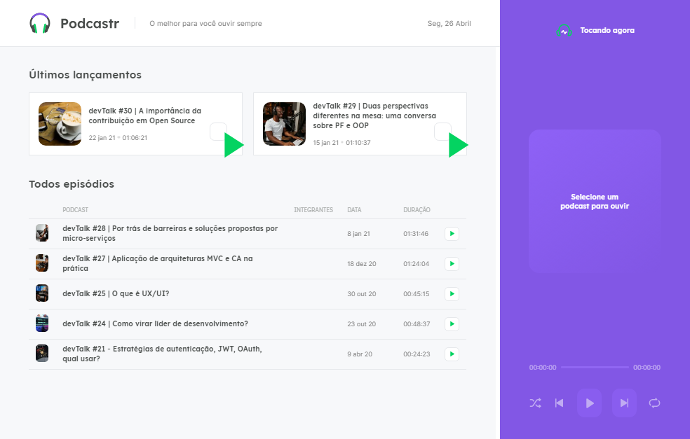

# Podcaster

<p align="center">
  <a href="#-tecnologias">Techs</a>&nbsp;&nbsp;&nbsp;|&nbsp;&nbsp;&nbsp;
  <a href="#-project">Project</a>&nbsp;&nbsp;&nbsp;|&nbsp;&nbsp;&nbsp;
  <a href="#-layout">Layout</a>&nbsp;&nbsp;&nbsp;|&nbsp;&nbsp;&nbsp;
  <a href="#memo-licença">Licença</a>
</p>

<p align="center">
 

  
</p>

<br>

<p align="center">
  
</p>

## 🚀 Techs

Esse projeto foi desenvolvido com as seguintes tecnologias:
- [X] TypeScript
- [X] ReactJS
- [X] [Next.js](https://nextjs.org/docs)

### Dependencies
- [X] Yarn
- [X] Axios
- [X] JSON-Server
- [X] SASS
- [X] Date-Fsn
- [X] Rc-slider

### Features

- [X] SSG
- [X] Fake API
- [X] Perfomatic
- [X] Clean Code

- [ ] Response
- [ ] Dark theme or Omini theme
- [ ] PWA 
- [ ] electron.js 

## 💻 Project

Podcaster is an aplication made on the nlw5(Next Level Week), focusing on Next.js, and react exencials.  

### Requirements

- You need to install both [Node.js](https://nodejs.org/en/download/) and [Yarn](https://yarnpkg.com/) to run this project.

**Clone the project and access the folder**

```bash
$ git clone https://github.com/Thiago-spart/Podcaster.git && cd Podcastr
```

**Follow the steps below**

```bash
# Install the dependencies
$ yarn

# Run the backend fake server
$ yarn server

# Run the web server
$ yarn dev
```

## 🔖 Layout

You can see the project's layout on [this link](https://www.figma.com/file/IhYMqaVMC4Hg2FT3MZth52/Podcastr-(Copy)?node-id=160%3A2761). It's necessary have an account on [Figma](https://figma.com) to see it.

## :memo: License

This project is licensed by the MIT license. Check it out in [LICENSE](./LICENSE.md) for more details.